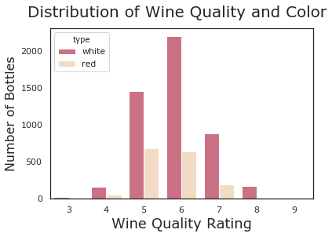
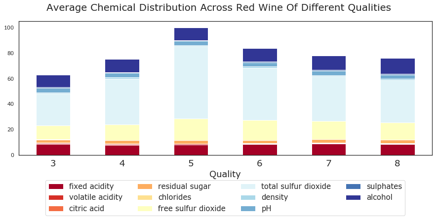
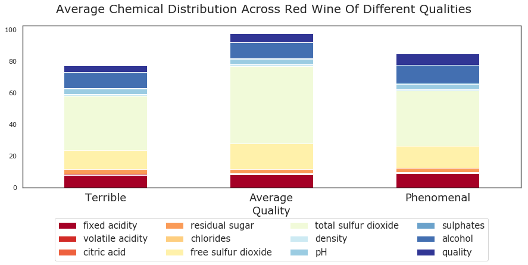
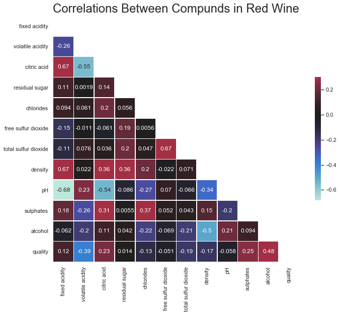
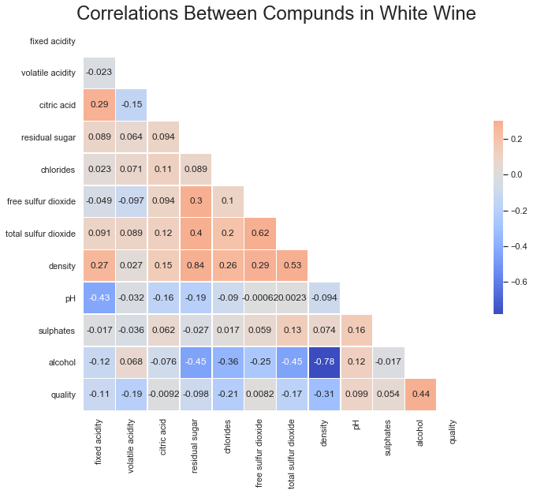
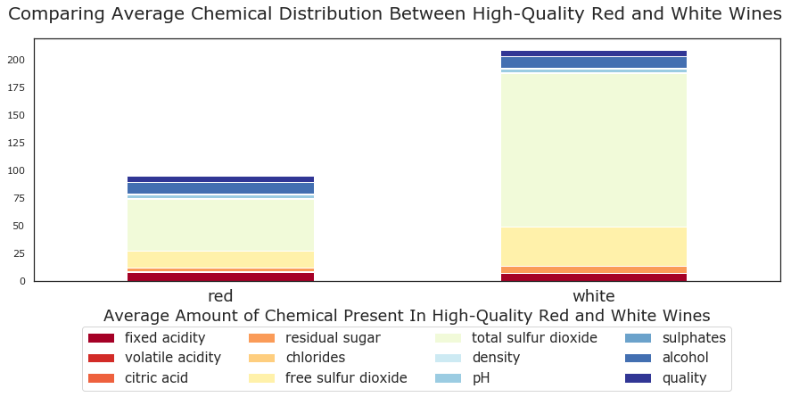

# Wine_Quality
In this demo, we will search for factors that correlate with a wine being high-quality. By the end, we will gain insight as to what makes a bottle phenomenal, and whether these factors differ based on its color.

### What's in our dataset?
In 2009, Portuguese scientists collected massive inventory of different Vinho Verde wines, and made the dataset open for the community to study. It contains data on more than 5K kinds of wine, and measures 11 different physiochemical properties.

### What's exactly do these chemicals imply for consumers?
**Fixed Acidity:** Gives wine a tart flavor. If there's too little, wine tastes "flat".

**Citric Acid:** Often used as a flavor additive. Adds a fresh, tart taste.

**Volatile Acidity:** In contrast to citric acid, which is a liquid, this is gaseous acidity that can smell like vinegar. Its presence is less likely to be intentional.

**Residual Sugar:** This is the sugar left over when grapes finish fermenting. Correlates with sweetness. “Dry wines” tend to have lower amounts.

**Sulfur:** Additive to prevent bacterial growth. In my research, it was contested whether or not there is a smell or taste associated with it.

**Chlorides:** The measure of salt.

### Is the distribution of red and white wine bottles even?

From the above plot, we can observe that we have imbalance in our data. But for this demo, we're just going to visualize static data, so we can ignore the overrepresentation for time being.

### Is there any difference in chemical composition between different ratings of wine?

At first glance, the chemicals follow a bell-curve like distribution and notice an 8-star wine looks not much different than a 4-star wine, sound intuitive, doesn't it? I think the data is scattered across too many wine-quality groupings, lets try creating meaningful groupings to gain insight.  

**We care less about difference between a 3 and 4-star bottle, we want to identify what causes the jump between a 3 and an 8. What makes a bottle _phenomenal_**

### What trends do we see in red wines?
> By grouping our wines more intuitively, we uncover a few valuable relationships.

**1. Low Salt:** On average, the worst red wines have greatest amount of chlorides. This makes sense given chlorides measured that "salty" character. "Phenomenal" wine has the least.

**2. Acidity Matters:** "phenomenal" wines have the least amount of volatile acidity, and the greatest amount of citric acid. Given what we know about wine acids, this makes sense: the citric acid was likely deliberately introduced because it gives the wine a pleasant taste, but the volatile acids were likely a product of poor fermentation.

**3. Alcohol is the King:** The best wines have the most alcohol.

### Are there any additional relationships we can explore that could help explain why each snapshot looks the way it does?

From the above heatmap we can observe - for red wine, alcohol content has relatively strong correlation with wine quality rating(.48), followed by volatile acidity(-.39).

Few other correlations to notice is that alcohol is less dense than water, so it makes sense that more alcohol would be correlated with a lower wine density.

Likewise we would expect there to be a strong correlation between pH and Acidity, given pH measures whether a substance leans towards being acid or a base.

### Is there a difference in the correlations for a high quality white wine?

At first glance, we seen that even for white wines, alcohol content has the most positive correlation with quality.

Compared to red wines, for which the presence of citric acid had a 20% correlation with quality, the white wines had a 0% correlation between citric acid and quality.

At chemical level, great white wines had 2-4 times the amount of sulfur than their red counterparts.

From what we learned about sulfure as an additive to prevent spoilage, unless white wine have more naturally occuring sulfur, it is possible that to ferment them necessitates extra protection as opposed to red(just as red wine benefits from the addition of citric acid).

Additionally, white wines had half the amount of chlorides the reds did, but nearly twice as much sugar. They were also slightly less acidic.

**Despite these differences, the alcohol content of high-quality red and white wines was roughly the same.**

> Whether red or white, I think consumer would be happy with nearly any bottle with a high alcohol content. Citric acid content won't make a difference when purchasing a white bottle, but it will often make or break your red.